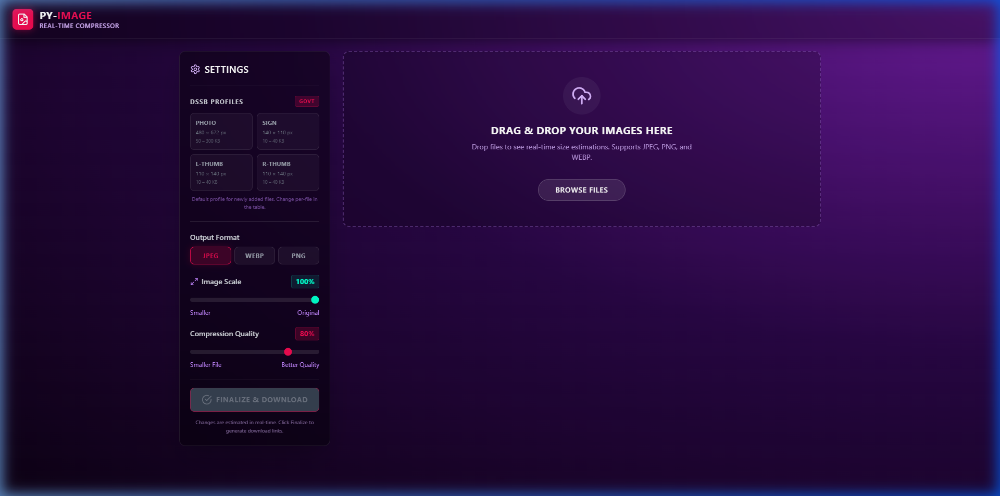
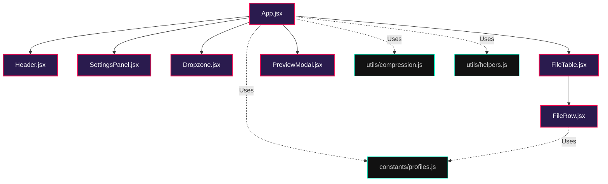

# PY-IMAGE Real-Time Compressor ⚡🖼️

A fast, premium, client-side browser image compressor tailored for government document compliance and bulk image optimization. Built with **React 18 + Vite + TailwindCSS 3**.



---

## ✨ Features

*   **🔒 100% Client-Side Privacy**: All compression, resizing, and optimizations are computed entirely inside your browser. No files are ever uploaded to a backend or server.
*   **📋 DSSB Govt-Compliant Profiles**: Auto-targets specific dimension and file size configurations required by government portal forms:
    *   **Photo**: 480 × 672 pixels (5 × 7 inches) | 50 KB – 300 KB (JPEG)
    *   **Signature**: 140 × 110 pixels | 10 KB – 40 KB (JPEG)
    *   **Left Thumb**: 110 × 140 pixels | 10 KB – 40 KB (JPEG)
    *   **Right Thumb**: 110 × 140 pixels | 10 KB – 40 KB (JPEG)
*   **🔍 Draggable Before/After Comparison**: Compare original and compressed details side-by-side using an interactive split-view slider (mouse & touch friendly).
*   **⚡ Smart Size Targeter**: Employs an iterative **binary search algorithm** to automatically fine-tune JPEG/WebP export quality levels until the image size fits perfectly in the target profile's KB range.
*   **📦 Batch ZIP Downloader**: Download multiple completed images grouped automatically into a single, structured `.zip` folder.
*   **Manual Mode Controls**:
    *   **Format Options**: Export to JPEG, WebP, or PNG formats.
    *   **Image Scaling**: Resize height and width dimensions from 10% to 100%.
    *   **Compression Quality**: Lossy quality sliders from 10% to 100% (automatically hidden for PNG).

---

## 🛠️ Technology Stack

*   **Frontend Library**: React 18
*   **Build Utility**: Vite 5
*   **Styling**: TailwindCSS 3
*   **Icons**: Lucide React
*   **Archive Utility**: JSZip

---

## 🚀 Getting Started

### Prerequisites

*   [Node.js](https://nodejs.org) (v18 or higher recommended)
*   npm or yarn

### Installation

1.  Clone the repository:
    ```bash
    git clone https://github.com/PrinceBad/Py-Image-Compressor.git
    cd Py-Image-Compressor
    ```

2.  Install dependencies:
    ```bash
    npm install
    ```

3.  Run the local development server:
    ```bash
    npm run dev
    ```

4.  Build for production:
    ```bash
    npm run build
    ```

---

## 📁 Project Structure

```bash
py-image-compressor/
├── 📁 public/                 # Static assets (Favicons, images)
├── 📁 src/                    # Main application source code
│   ├── 📁 components/         # Modular user interface components
│   │   ├── 📄 Dropzone.jsx       # Drag-and-drop file upload target area
│   │   ├── 📄 FileRow.jsx        # Table row showing individual file stats & actions
│   │   ├── 📄 FileTable.jsx      # Queue layout structure containing all files
│   │   ├── 📄 Header.jsx         # App top-bar logo, theme stats & estimates
│   │   ├── 📄 PreviewModal.jsx   # Draggable split-pane before/after visual comparer
│   │   └── 📄 SettingsPanel.jsx  # Main controls & DSSB profiles list selection
│   ├── 📁 constants/          # Application-wide static data
│   │   └── 📄 profiles.js        # Government DSSB file specifications
│   ├── 📁 utils/              # Pure utility functions & core engine algorithms
│   │   ├── 📄 compression.js     # Image resizing & binary search canvas compression
│   │   └── 📄 helpers.js         # File size formatters & savings calculators
│   ├── 📄 App.jsx             # Main application driver & central state orchestrator
│   ├── 📄 main.jsx            # Entry script that boots React into index.html
│   └── 📄 index.css           # Styling directives including Tailwind layers
├── 📄 index.html              # HTML core shell template
├── 📄 package.json            # Scripts and third-party dependencies configuration
├── 📄 tailwind.config.js      # Tailwind UI design tokens & theme setup
├── 📄 vite.config.js          # Vite build pack configuration file
└── 📄 README.md               # Project documentation
```

---

## 📐 Application Architecture & Flow



